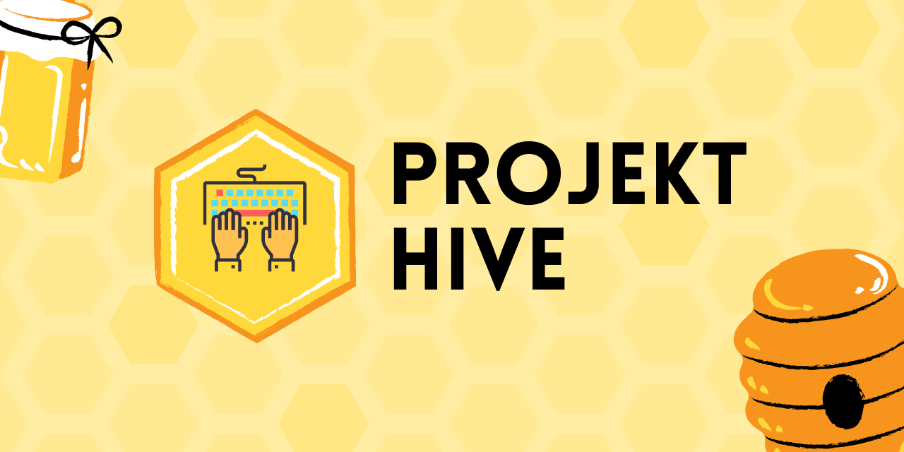

# Projekt Hive

## Problem Definition

**Ensuring the timely delivery of projects is hard.** There are three critical factors among various others that determine the success of a project delivery: 

1. Team motivation
2. Timely tracking of the project progress
3. Winning distribution of project managers' time

All of these factors are concerns for both the project managers and the team.

### Team Motivation

Consistently keeping the motivation is hard for the team as there are psychological aspects that are in play. Even though it could be hard to address all of these factors, some of them can be automated:

1. **Progress:** Software development teams value the progress. Continuously seeing that the project is progressing successfully keeps team motivation high.
2. **Visibility of individual contributions:** The more visible an individual's contributions to a project, the more motivated they will feel as it helps them get the credit for their contributions. People like to be appreciated, and it is a very natural inclination.
3. **Visibility of the impact of individual contribution:** Instead of developing features in isolation, helping the team be aware of their individual contributions will keep the team more motivated. They will know that they are responsible for one another.

A motivated and well-performing team is also an essential source of motivation for the project managers to go above and beyond in their daily work.

### Timely tracking of the project progress

Successfully monitoring a project's progress depends on the proper communication between the managers and the team members. Any delayed communication will impact the project delivery date adversely. In reality, it is hard to deliver the project on time with the defined scope. Hence, it is an ordinary practice for the project managers and teams to re-prioritize the functional requirements throughout the project development. Therefore, the team needs to communicate the status of their work on time. The status can be things like blocked work items, completed work items, resolved/pending work items, etc.

There are already many venues for the teams to communicate the statuses of their work items. These venues include sprint boards as offered by Azure DevOps, Version One, Github. Also, the team share a quick update of their work progress during the scrum's standup meetings. The bigger the team gets, the easier for the project manager to forget the status communicated verbally by their team members. Therefore, it is generally the best to keep the sprint board current so that everyone can easily see the progress of everyone's work.

### Winning distribution of project managers' time

Project managers play a critical role in the success of their teams. The more time they spend on time-consuming but less strategic duties, the less time they will spend with their team, which includes establishing a close connection with their team members and be there when the team should be unblocked. A manager's time cannot free up unless their repetitive duties are automated. Also, these repetitive tasks won't scale well as the number of team member increase.

## The Solution

An automation tool helps the team stay motivated while making the project development progress tracking a more proactive endeavor. The fundamental responsibilities of this tool would include:

1. Proactively reviewing the sprint board, makes suggestions, and sends on-time reminders to the team members to unblock issues that make the project progress tracking harder.
2. Making the individual contributions more visible via frequently accessed communication environments like Google Chat or Slack.
3. Making the overall progress of a project development visible via frequently accessed communication environments like Google Chat or Slack.
3. Creating a competitive team environment to empower both the individual efforts and team efforts. A sample metric would be collecting and reporting the quality of a work rather than the quantity of work completed by an engineer. Another metric would be the timeliness and the quality of the communication from a team member of their work status. It is usually the quantity of work expected from an engineer that creates a hostile team environment. Gamification of this process with constructs like "Leadership Board" and "The best of the week" could do revolutionary wonders in the motivation in the long run. The top engineers can also be rewarded with small gifts and evaluated accordingly at the yearly performance reviews.
4. Freeing up roject managers' time by automating some of their most repetitive responsibilities. Managers then can spend more time unblocking their team members and listen to them more for their needs.

## Projekt Hive

Projekt Hive aims to address these issues by implementing the recommended solution above. It is intentonally spelled as "Projekt" with K as it aims to offer a non-traditional solution to a traditional problem. Therefore, the letter "K" represents the deviation from the standards. The word "Hive" represents the team factor in the solution. It aims to improve the team by improving the individual and create a positive feedback loop between the team and the individuals. 

### FAQ

#### Where is the source code?

The actual development happens in a private repo until it is ready.

#### How can I contribute?

Currently, no contributions are needed until further notice.

#### Where does this idea come from?

From my first project: **Manager Automation**, which can be found here: https://github.com/tarikguney/managers-automation

#### Where can I ask about my questions?

Use the discussion tab. I would like to hear from you.

#### Who is the primary owner of this project?

Tarik Guney (https://www.linkedin.com/in/tarikguney)

